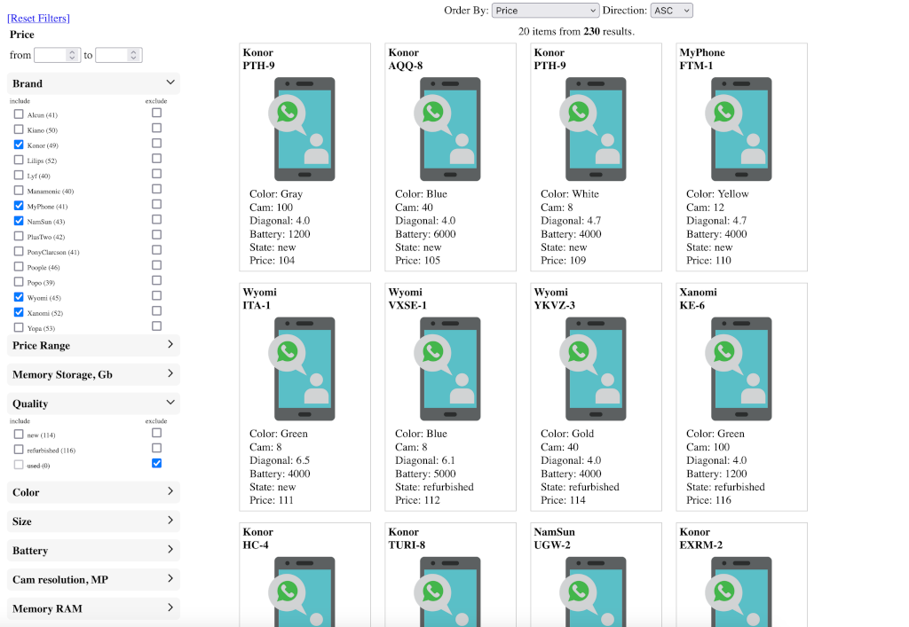

[](https://github.com/k-samuel/faceted/pkg/actions/workflows/go.yml)
[](https://goreportcard.com/report/github.com/k-samuel/faceted)
[](https://github.com/k-samuel/faceted/pkg/releases/latest)

# Golang Faceted Search Library v3.2.1
Experimental port of PHP k-samuel/faceted-search v3.2.1
PHP Library https://github.com/k-samuel/faceted-search

## Возможности

- Быстрый фасетный поиск без использования дополнительных серверов (ElasticSearch и т.д.)
- Поддержка до 1,000,000+ записей с 10 свойствами
- Агрегация фильтров (построение доступных значений фильтров)
- Исключающие фильтры
- Фильтры по диапазону (RangeFilter)
- Фильтры с условием AND (ValueIntersectionFilter)
- Сортировка результатов
- Индексация числовых диапазонов (RangeIndexer, RangeListIndexer)
- Два типа хранилищ: ArrayStorage и FixedArrayStorage


## Поддерживаемые типы значений
На вход:
```go
bool
int
int64
float32
float64
[]int
[]int64
[]string
[]interface{}
map[string]interface{}
```

*Интерфейсы дложны содержать примитивы перечисленные в этом списке*

Результаты агрегации search.Aggregate() содержат список доступных значений фильтров, который приведен к типу string, обратите на это внимание. Это упрощает обработку структуры результатов.

Если этих типов недостаточно, необходимо заинжектить свой value.ValueConverterInterface:

```go
import(
    "github.com/k-samuel/faceted"
    "github.com/k-samuel/faceted/pkg/index"
    "github.com/k-samuel/faceted/pkg/value"
 )
//...
// Create index using Factory
search := faceted.NewSearch()
// Injecting value converter.
// Here you can set your own value.ValueConverter interface realisation
search = search.WithValueConverter(value.NewValueConverterDefault())
searchIndex, err := search.NewIndex(faceted.ArrayStorage)
//...

```

### Golang version benchmark

Bench Golang (1.25) vs PHP (8.4.4 Opcache JIT, noxdebug) 1M records

|                         | GO         |     PHP   | 
|:------------------------|-----------:|----------:|
| Total Memory, Mb        |  134 Mb    | 417 Mb    |
| Find                    |  0.051789  | 0.022873  |
| Find & Sort             |  0.066998  | 0.030061  |
| Find (unsets)           |  0.067185  | 0.030475  |
| Find (ranges)           |  0.068525  | 0.031425  |
| Filters                 |  0.215391  | 0.065416  |
| Filters & count         |  0.390790  | 0.133543  |
| Filters & count & exc   |  0.423006  | 0.146758  |


# Note

Search index should be created in one thread before using. Currently, Index hash map access not using mutex. 
It can cause problems in concurrent writes and reads.


## Установка

```bash
go get github.com/k-samuel/faceted
```

## Структура проекта

```
pkg/
├── filter/          # Фильтры (ValueFilter, RangeFilter, ExcludeValueFilter, etc.)
├── index/           # Индекс (Index, Profile)
├── indexer/         # Индексеры (RangeIndexer, RangeListIndexer)
├── intersection/    # Пересечения (ArrayIntersection)
├── query/           # Запросы (SearchQuery, AggregationQuery, Sort)
├── sort/            # Сортировка (Filters, AggregationResults, ArrayResults)
├── storage/         # Хранилища и сканнер (ArrayStorage, Scanner)
cmd/
├── perf/            # Performance test
├── perf-data/       # Performance test data generator
└── tests/           # Unit tests
    └── data/        # Generated test data for performance test
main.go              # Пример использования
go.mod
```


## Быстрый старт

### Создание индекса

```go
package main

import (
    "github.com/k-samuel/faceted"
    "github.com/k-samuel/faceted/pkg/filter"
    "github.com/k-samuel/faceted/pkg/query"
)

func main() {
    // Создание индекса
    search := faceted.NewSearch()
    searchIndex, _ := search.NewIndex(faceted.ArrayStorage)
    storage := searchIndex.GetStorage()

    // Добавление данных
    data := []map[string]interface{}{
        {"id": 7, "color": "black", "price": 100, "sale": true, "size": 36},
        {"id": 9, "color": "green", "price": 100, "sale": true, "size": 40},
    }

    for _, item := range data {
        recordId := int(item["id"].(int))
        delete(item, "id")
        storage.AddRecord(recordId, item)
    }

    // Оптимизация индекса
    storage.Optimize()
}
```

### Поиск с фильтрами

```go
import (
    "github.com/k-samuel/faceted"
    "github.com/k-samuel/faceted/filter"
    "github.com/k-samuel/faceted/query"
)
search := faceted.NewSearch()
searchIndex, _ := search.NewIndex(faceted.ArrayStorage)
storage := searchIndex.GetStorage()
// Создание фильтров
filters := []filter.FilterInterface{
    search.NewValueFilter("color", []interface{}{"black", "green"}), // OR условие
    search.NewRangeFilter("size", search.NewRangeValue(36, 40),
}

// Поиск
searchQuery := search.NewSearchQuery().Filters(filters)
records := searchIndex.Query(searchQuery)
```

### Агрегация (построение доступных фильтров)

```go
search := faceted.NewSearch()
searchIndex, _ := search.NewIndex(faceted.ArrayStorage)
// Агрегация без подсчёта количества
aggQuery := search.NewAggregationQuery().Filters(filters)
aggData := searchIndex.Aggregate(aggQuery)

// Агрегация с подсчётом и сортировкой
aggQuery2 := search.NewAggregationQuery().
    Filters(filters).
    CountItems(true).
    Sort(query.SortAsc, query.SortRegular)
aggData2 := searchIndex.Aggregate(aggQuery2)
```

### Исключающие фильтры

```go
search := faceted.NewSearch()
searchIndex, _ := search.NewIndex(faceted.ArrayStorage)
storage := searchIndex.GetStorage()
filters := []filter.FilterInterface{
    search.NewValueFilter("sale", []interface{}{1}),
    search.NewExcludeValueFilter("color", []interface{}{"blue"}),
}
records := searchIndex.Query(search.NewSearchQuery().Filters(filters))
```

### ValueIntersectionFilter (AND условие)

```go
search := faceted.NewSearch()
// Для полей с несколькими значениями
// Record: {"purpose": ["hunting", "fishing", "sports"]}
filter := search.NewValueIntersectionFilter("purpose", []interface{}{"hunting", "fishing"})
// Найдёт записи, где есть И hunting, И fishing
```

### RangeIndexer для числовых диапазонов

```go
search := faceted.NewSearch()
searchIndex, _ := search.NewIndex(faceted.ArrayStorage)
storage := searchIndex.GetStorage()
// Создание индексера с шагом 100
rangeIndexer, _ := search.NewRangeIndexer(100)
storage.AddIndexer("price", rangeIndexer)

// Добавление данных
storage.AddRecord(1, map[string]interface{}{"price": 90})
storage.AddRecord(2, map[string]interface{}{"price": 150})

// Поиск по диапазону
filters := []filter.FilterInterface{
    search.NewRangeFilter("price", search.NewRangeValue(100,)),
}
records := searchIndex.Query(search.NewSearchQuery().Filters(filters))
```

### RangeListIndexer для пользовательских диапазонов

```go
search := faceted.NewSearch()
searchIndex, _ := search.NewIndex(faceted.ArrayStorage)
// Создание диапазонов: 0-99, 100-499, 500-999, 1000+
rangeIndexer, _ := search.NewRangeListIndexer([]int{100, 500, 1000})
searchIndex.GetStorage().AddIndexer("price", rangeIndexer)
```

### Сортировка результатов

```go
search := faceted.NewSearch()
searchIndex, _ := search.NewIndex(faceted.ArrayStorage)
// Сортировка по убыванию цены
searchQuery := search.NewSearchQuery().
    Filters(filters).
    Sort("price", query.SortDesc, query.SortNumeric)
records := searchIndex.Query(searchQuery)
```

### Экспорт/Импорт индекса

```go
search := faceted.NewSearch()
searchIndex, _ := search.NewIndex(faceted.ArrayStorage)
storage := searchIndex.GetStorage()

// Экспорт
indexData := storage.Export()

// Импорт
searchIndex, _ := search.NewIndex(faceted.ArrayStorage)
searchIndex.GetStorage().SetData(indexData)
```

## API

### Фильтры

| Фильтр | Описание |
|--------|----------|
| `ValueFilter` | Фильтр по значению (OR условие для нескольких значений) |
| `ValueIntersectionFilter` | Фильтр по значениям (AND условие) |
| `RangeFilter` | Фильтр по диапазону (min, max) |
| `ExcludeValueFilter` | Исключение по значению |
| `ExcludeRangeFilter` | Исключение по диапазону |

### Query

| Query | Описание |
|-------|----------|
| `SearchQuery` | Поисковый запрос с фильтрами и сортировкой |
| `AggregationQuery` | Запрос агрегации для построения доступных фильтров |
| `Order` | Настройки сортировки |
| `AggregationSort` | Настройки сортировки агрегации |

### Storage

| Storage | Описание |
|---------|----------|
| `ArrayStorage` | Быстрое хранилище на основе map |


### Запуск демо приложения

```bash
cd cmd/demo
go run main.go
```
Запустится локальный web сервер http://127.0.0.1:8080/




### Test
` go test  ./tests  -coverpkg  ./pkg/... -v -coverprofile=cover.out && go tool cover -html=cover.out -o cover.html `

### Интеграционный тест производительности (аналог PHP tests/performance/find.php)
Внимание, запускается из корневой папки
```bash
# Создайте тестовый набор данных (нужно сделать один раз)
go run cmd/perf-data/main.go -size 100000
# Запустите тест
go run cmd/perf/main.go -size 100000
```


### Запуск простых примеров
```bash
 go run examples/sample/main.go
```


## Лицензия

MIT License - см. оригинальный проект https://github.com/k-samuel/faceted-search