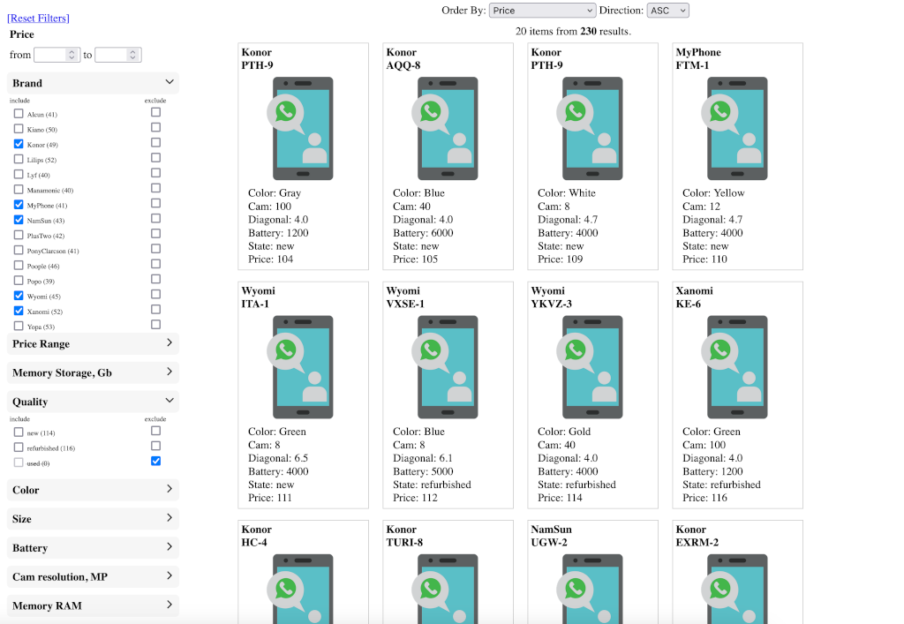

[](https://github.com/k-samuel/faceted/actions/workflows/go.yml)
[](https://goreportcard.com/report/github.com/k-samuel/faceted)
[](https://github.com/k-samuel/faceted/pkg/releases/latest)

# Golang Faceted Search Library 3.x
Port of PHP [k-samuel/faceted-search](https://github.com/k-samuel/faceted-search) branched from v3.2.4

Simplified and fast faceted search without using any additional servers such as ElasticSearch, etc.

It can easily process up to 1,000,000 items with 10 properties. Create individual indices for product groups or categories and you won't need to scale or use more complex tools for a long time.

In addition to faceted filters, it supports exclusive filters.

The library is designed for use with classic databases.
It allows you to quickly build aggregates for filters and filter data by query.
It returns a list of record IDs that need to be retrieved from the database for display to the client.
Optimized for high-speed construction of complex aggregates.

## Features
- Fast standalone inmemory faceted search without using additional servers (ElasticSearch, etc.)
- Support unstructured sets of fields
- Support 1,000,000+ records with 10 properties
- Filter aggregation (building available filter values)
- Range filters (RangeFilter)
- Exclusion filters (ExcludeValueFilter, ExcludeRangeFilter)
- Filters with AND conditions (ValueIntersectionFilter)
- Result sorting
- Fast Indexing of numeric ranges (RangeIndexer, RangeListIndexer)


### Golang version benchmark

Bench Golang (1.25) vs PHP (8.4.4 Opcache JIT, noxdebug) 1M records

|                         | GO          |     PHP   | 
|:------------------------|------------:|----------:|
| Total Memory, Mb        |☑  135 Mb   |   424 Mb   |
| Find                    |☑  0.012614 |   0.022412 |
| Find & Sort             |☑  0.025579 |   0.031215 |
| Find (unsets)           |    0.051595 | ☑ 0.032979|
| Find (ranges)           |☑  0.030602 |    0.031372|
| Filters                 |☑  0.064140 |    0.084003|
| Filters & count         |    0.247243 | ☑ 0.140964|
| Filters & count & exc   |    0.296577 | ☑ 0.154913|


# Note

Search index should be created in one thread before using. Currently, Index hash map access not using mutex. 
It can cause problems in concurrent writes and reads.


## Install

```bash
go get github.com/k-samuel/faceted
```

## Project structure

```
faceted/
├── search/              # Main library
│   ├── indexer/         # Indexers (RangeIndexer, RangeListIndexer)
│   ├── value/           # Value converter (Converter)
│   ├── container.go     # Container factory
│   ├── db.go            # Main DB struct
│   └── ...
├── cmd/
│   ├── perf/            # Performance test
│   └── perf-data/       # Performance test data generator
├── examples/
│   ├── sample/          # Simple examples
│   └── demo/            # Demo application
├── tests/               # Unit tests
│   └── data/            # Generated test data for performance test
├── go.mod
└── go.sum
```


## Quick start

### Creating an index

```go
package main

import (
    "github.com/k-samuel/faceted/search"
)

func main() {

    // Create Search Index using dependency factory
    db := search.NewContainer().NewDb()
    storage := db.GetStorage()

    // Add data
    data := []map[string]interface{}{
        {"id": 7, "color": "black", "price": 100, "sale": true, "size": 36},
        {"id": 9, "color": "green", "price": 100, "sale": true, "size": 40},
    }

    for _, item := range data {
        recordId := int(item["id"].(int))
        delete(item, "id")
        storage.AddRecord(recordId, item)
    }

    // Index optimization
    storage.Optimize()
}
```

### Search with filters

```go
import (
    "github.com/k-samuel/faceted/search"
)

db := search.NewContainer().NewDb()

// Create filters
filters := []search.FilterInterface{
    search.NewValueFilter("color", []interface{}{"black", "green"}), // OR condition
    search.NewRangeFilter("size", search.NewRangeValue(36, 40)),
}

// Search
searchQuery := search.NewSearchQuery().Filters(filters)
records := db.Query(searchQuery)
```

### Aggregation (building available filters)

```go
db := search.NewContainer().NewDb()
// Aggregation without counting the quantity
aggQuery := search.NewAggregationQuery().Filters(filters)
aggData, err := db.Aggregate(aggQuery)
//......
// Aggregation with counting and sorting
aggQuery2 := search.NewAggregationQuery().
    Filters(filters).
    CountItems(true).
    Sort(search.SortAsc, search.SortAsc)
aggData2, err := db.Aggregate(aggQuery2)
```

### Exclusion filters

```go
db := search.NewContainer().NewDb()
filters := []search.FilterInterface{
    search.NewValueFilter("sale", []interface{}{1}),
    search.NewExcludeValueFilter("color", []interface{}{"blue"}),
}
records, err := db.Query(search.NewSearchQuery().Filters(filters))
```

### ValueIntersectionFilter (AND condition)

```go
db := search.NewContainer().NewDb()
// For fields with multiple values
// Record: {"purpose": ["hunting", "fishing", "sports"]}
filter := search.NewValueIntersectionFilter("purpose", []interface{}{"hunting", "fishing"})
// Finds records that contain both hunting and fishing
```

### RangeIndexer for numeric ranges

```go
import (
    "github.com/k-samuel/faceted/search"
    "github.com/k-samuel/faceted/search/indexer"
)

db := search.NewContainer().NewDb()
storage := db.GetStorage()

// Create an indexer with a step of 100
rangeIndexer, err := indexer.NewRangeIndexer(100)
if err != nil {
    // handle error
}
storage.AddIndexer("price", rangeIndexer)

// Add data
storage.AddRecord(1, map[string]interface{}{"price": 90})
storage.AddRecord(2, map[string]interface{}{"price": 150})

// Search by range
filters := []search.FilterInterface{
    search.NewRangeFilter("price", search.NewRangeValue(100, 200)),
}
records, err := db.Query(search.NewSearchQuery().Filters(filters))
```

### RangeListIndexer for custom ranges

```go
import (
    "github.com/k-samuel/faceted/search"
    "github.com/k-samuel/faceted/search/indexer"
)

container := search.NewContainer()
db := search.NewContainer().NewDb()
// Create ranges: 0-99, 100-499, 500-999, 1000+
rangeIndexer, err := indexer.NewRangeListIndexer([]int{100, 500, 1000})
if err != nil {
    // handle error
}
storage.AddIndexer("price", rangeIndexer)
```

### Sorting results

```go
db := search.NewContainer().NewDb()
// Sort by price descending
searchQuery := search.NewSearchQuery().
    Filters(filters).
    Sort("price", search.SortDesc, search.SortTypeNumbers)
records := db.Query(searchQuery)
```

### Index Export/Import

```go
db := search.NewContainer().NewDb()
storage := db.GetStorage()

// Export
indexData := storage.Export()

// Import
db2 := container.NewDb()
db2.GetStorage().SetData(indexData)
```

## API

### Filters

| Filter | Description |
|--------|---------|
| `ValueFilter` | Value filter (OR condition for multiple values) |
| `ValueIntersectionFilter` | Value filter (AND condition) |
| `RangeFilter` | Range filter (min, max) |
| `ExcludeValueFilter` | Value exclusion |
| `ExcludeRangeFilter` | Range exclusion |

### Query

| Query | Description |
|-------|----------|
| `SearchQuery` | Search query with filters and sorting |
| `AggregationQuery` | Aggregation query for building available filters |
| `Sort` | Sorting settings |
| `AggregationSort` | Aggregation sorting settings |

### Storage

| Storage | Description |
|---------|----------|
| `MapStorage` | Fast map-based storage |

## Supported value types
Input:
```go
bool
int
int64
float32
float64
[]int
[]int64
[]string
[]interface{}
map[string]interface{}
```

*Interfaces must contain the primitives listed in this list*

The results of search.Aggregate() contain a list of available filter values, cast to a string type. It simplifies processing the result structure.

If these types are insufficient, you need to inject your own value.ValueConverterInterface (cast your type to string):

```go
import(
    "github.com/k-samuel/faceted/search"
    "github.com/k-samuel/faceted/search/value"
 )
// Here you can set your own value.ValueConverter interface realisation
provider := search.NewContainer(search.WithValueConverter(value.NewConverter()))
```

### Demo application
[Demo application](examples/demo/)
```bash
git clone https://github.com/k-samuel/faceted.git
cd faceted/examples/demo
go run main.go
```
The local web server will start at http://127.0.0.1:8080/




### Test
` go test  ./search  -coverpkg  ./search/... -v -coverprofile=cover.out && go tool cover -html=cover.out -o cover.html `

### Integration performance test (similar to PHP tests/performance/find.php)
Note: Runs from the project root directory.
```bash
# Create a test dataset (only needs to be done once)
go run cmd/perf-data/main.go -size 100000
# Run the test
go run cmd/perf/main.go -size 100000
```

### Simple Examples
```bash
 go run examples/sample/main.go
```

## License

MIT License